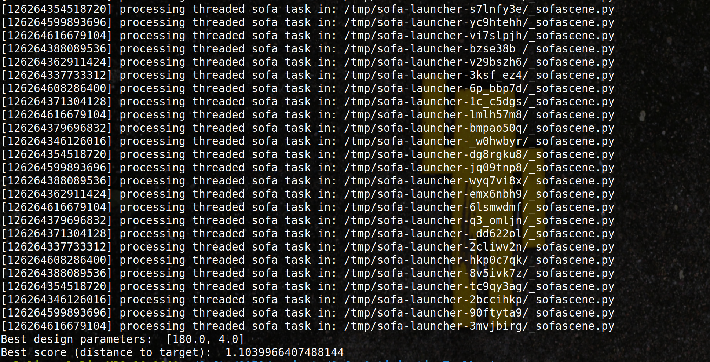

# Brute Force with sofa-launcher 

## Requirements

Download [Sofa-launcher](https://github.com/sofa-framework/sofa-launcher).

Install Python and modules : 
```console
    python -m pip install toml cheetah3 csv
```

Environment variables :
```console
    export PATH="PATH_TO_SOFA_BUILD/bin/":$PATH
    export PYTHONPATH="PATH_TO_SOFA_LAUNCHER/":$PYTHONPATH
```

## How to

Launch parallel simulations:

```console
python methods/bruteforce/work.py
```

This will run multiple simulations of the cantilever beam with different design parameters (length and radius) and store the results in a CSV file. The parameters are defined in the `work.py` script.

In the same script, at the end, the results are analyzed to find the best design parameters that minimize the distance to the target position.

## Results

The best design parameters found after optimization with brute force are:
- `length`: 180 mm
- `radius`: 4 mm
  
With a score (distance to target) of 1.103 mm.

These parameters lead to a tip position of the beam that is close to the target position: 30 mm in the y direction.



__Brute Force logs with best parameters highlighted.__
