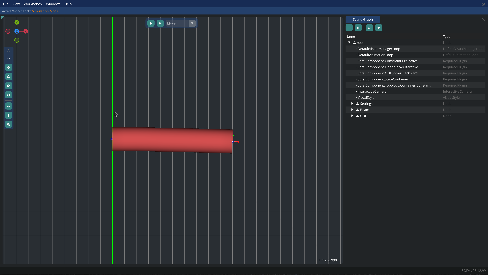
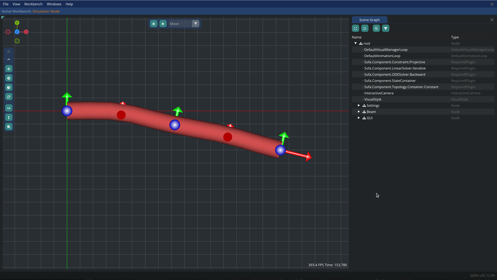
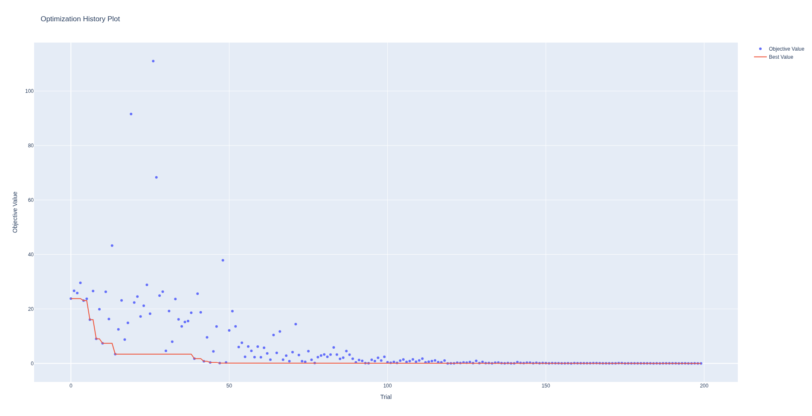

# Design optimization with Optuna

## Requirements

Install [Optuna](https://optuna.org/) and plotting libraries:

```bash
~$ pip install optuna cmaes plotly
```

Set environment variables:

```bash 
SOFA_ROOT=PATH_TO_SOFA_BUILD
PATH=$PATH:$SOFA_ROOT/bin/
PYTHONPATH=$PYTHONPATH:$SOFA_ROOT/lib/python3/site-packages/
```

## How to

Define your objective (see for example _example/beamObjective.py_) and run:

```bash
$ python methods/optuna/optimize.py yourObjective.py
```

## Results 

The parameters found after optimization with Optuna are:
- `length`: 166.5 mm
- `radius`: 3.5 mm
With a score (distance to target) of 0.009 mm.

These parameters lead to a tip position of the beam that is very close to the target position: 30 mm in the y direction.

<div style="display: flex; justify-content: space-around;">


</div>

__Cantilever beam before (left) and after (right) optimization.__



__Optuna study results showing the evolution of the objective function over trials.__
